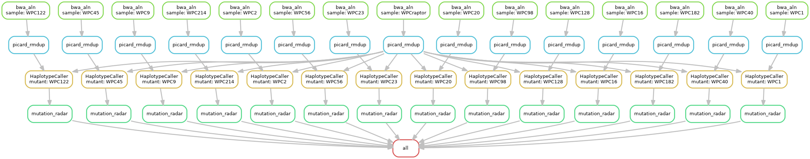

# Snakemake workflow


## Check the workflow

```
snakemake --dag -s mut_finder.sm.py --configfile config.yaml --cluster-config cluster.json |dot -Tpng > dag.png
```



## Run the workflow locally
```
snakemake -s mut_finder.sm.py --configfile config.yaml
```

## Run the workflow in a cluster

```
snakemake -s mut_finder.sm.py --configfile config.yaml --cluster-config cluster.json -j 100 --cluster "qsub -m e -q {cluster.queue} -l walltime={cluster.time} -l nodes=1:ppn={cluster.n} -e {cluster.error} -N {cluster.name} -o {cluster.output}"
```

